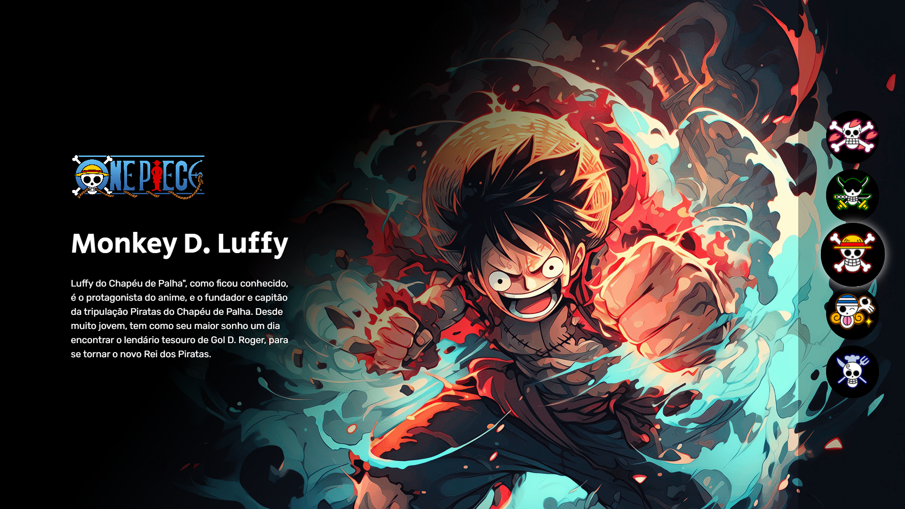

# Projeto One Piece

Este é um projeto simples que exibe informações sobre alguns personagens de One Piece e permite ao usuário selecionar um personagem clicando nos botões correspondentes.

## Conteúdo

- [Descrição](#descrição)
- [Pré-requisitos](#pré-requisitos)
- [Instruções de Uso](#instruções-de-uso)
- [Tecnologias Utilizadas](#tecnologias-utilizadas)
- [Projeto](#projeto)
- [Link](#link)

## Descrição

Este projeto consiste em uma página da web que exibe informações sobre cinco personagens de One Piece: Tony Chopper, Roronoa Zoro, Monkey D. Luffy, Nami e Sanji. O usuário pode selecionar um personagem clicando nos botões correspondentes na parte inferior da página.

## Pré-requisitos

- Navegador da web (Google Chrome, Mozilla Firefox, etc.)

## Instruções de Uso

1. Clone o repositório para o seu computador:

   ```bash
   git clone https://github.com/manoelarcanjo/Projetoonepiece

## Tecnologias Utilizadas 

- HTML
- CSS
- JavaScript

## Projeto 




## Links

 - [Site One Piece](https://onepiece-project.netlify.app/)
 - [LinkedIn](https://www.linkedin.com/in/manoelarcanjo/)


